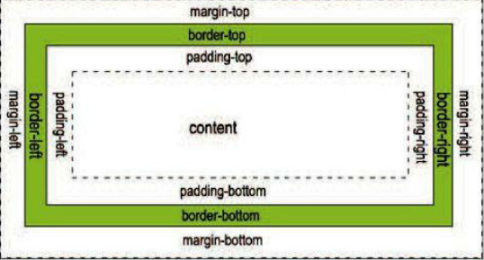
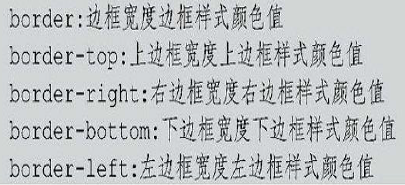
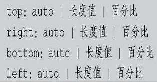

CSS
---------
##创建和插入
-  外部样式表
<pre><code>< head>  
< link rel="stylesheet" type="text/css" href="mystyle.css" />  
< /head></code></pre>
注意：  
**< link>是放在< head>中**；  

-  内部样式表   
<pre><code>< head>
< style type="text/css">
	hr {color: red;}
	p {margin-left: 20px;}
	body {color: red; }
< /style>
< /head></code></pre>

-  内联样式（谨慎使用）  
<pre><code>< p style="color: sienna; margin-left: 20px">
	This is a paragraph
< /p></code></pre>
##字体
-  字体font-family  
html中设置文字字体通过font的face属性，而在css中则使用font-family属性。  
语法：font-family:"字体一","字体二",...  
定义了多种字体时，如果浏览器中没有"字体一"时候，会采用"字体二"补充。  
**如何查看chrome浏览器支持那些命令呢？  
设置==>高级设置==>自定义字体**  
-  字号font-size  
html是的size属性控制，css通过font-size控制。    
font-size的取值范围如下：  
xx-small：绝对字体尺寸，最小。  
x-small：绝对字体尺寸，较小。  
small：绝对字体尺寸，小。  
medium：绝对字体尺寸，正常默认值。  
large：绝对字体尺寸，大。  
x-large：绝对字体尺寸，较大。  
xx-large：绝对字体尺寸，最大。  
larger：相对字体尺寸，相对于父对象中字体尺寸进行相对增大。  
smaller：相对字体尺寸，相对于父对象中字体尺寸进行相对减小。  
length：可采用百分比或长度值，不可为负值，其百分比取值是基于父对象中字体的尺寸。  
当然还可以自定义有多大的:  
<pre><code>.h5{
	font-family: "宋体";
	font-size: 100px;
}</code></pre>
-  字体风格font-style  
取值:normal、italic（斜体）oblique(偏斜体)  
-   加粗字体font-weight  
font-weight的取值范围包括normal、bold、bolder、lighter、number。其中normal表示正常粗细；bold表示粗体；bolder表示特粗体；lighter表示特细体；number不是真正的取值，其范围是100～900，一般情况下都是整百的数字，如200、300等。  
-  font-variant小写字母转成大写   
取值normal：正常显示,small-caps：小写转成大写  
-  font字体的复合属性  
font：字体取值(上面的各种值)  
按顺序设置如下属性(**可以省略不需要的字段**)：  
font-style  
font-variant  
font-weight  
font-size/line-height  
font-family  
##颜色和背景属性  背景颜色
-  颜色属性color  
取值:red green blue，或者16进制表示方法如:#ff0000。  
-  背景颜色backgroud-color  
**在html中，使用< body>中的bgcolor属性来设置网页的。而在css中，backgroud-color不仅可以用来设置网页的背景颜色，还能设置文字的背景颜色。**    
-  背景图像background-image  
语法：background-image:url(图像地址（可以是绝对地址或者是相对地址）)  
-  背景重复background-repeat  
background-repeat：取值  
取值包括了:no-repeat 背景图片不平铺、repeat表示背景图像铺满整个网页、repeat-x表示背景图像只在水平方向上平铺、repeat-y表示背景图像只在垂直方向上平铺。  
-  background-attachment  
background-attachment可以设置背景图像是随对象滚动还是固定不动。  
取值:fixed/scroll  
-  背景位置background-position  
>    设置值说明  
X（数值） 设置网页的横向位置，其单位可以是所有尺度单位  
Y（数值） 设置网页的纵向位置，其单位可以是所有尺度单位  
>
>  设置值说明  
0%　 0%  左上位置  
50%　0%  靠上居中位置  
100% 0%  右上位置  
0%　 50% 靠左居中位置  
50%　50% 正中位置  
100% 50% 靠右居中对齐  
0%　 100% 左下位置  
50%　100% 靠下居中对齐  
100% 100% 右下位置  
>
  设置值说明  
Top　   left    左上位置  
Top　   center  靠上居中位置  
Top　   right   右上位置  
Left　  center  靠左居中位置  
Center　center  正中位置  
Right　 center  靠右居中对齐  
Bottom　left    左下位置  
Bottom　center  靠下居中对齐  
Bottom　right   右下位置  

-  背景复合属性background  
例如：background:url(images/bg.png) no-repeat lest top;  
**不过我不太清楚设置顺序，大概为：背景颜色 背景图像 背景重复 背景附件 背景位置，各个属性之间以空格相连**  
##段落属性
-  单词间隔word-spacing  
word-spacing：取值(normal/长度值，长度值可以为负值)  
长度一般用的是em和px  
-  字符间隔letter-spacing  
letter-spacing:取值  
-  文字修饰text-decoration 
text-decoration:取值  
none:无  
underline：下划线  
overline：上划线  
line-through：删除线  
blink:文字闪烁效果(<b>不知道这是干嘛的？)</b>   
-  垂直对齐方式vertical-align    
vertical-align包括以下取值：  
baseline:浏览器默认的垂直对齐方式；  
**sub:文字的下标；  
super:文字的上标；**  
top：垂直靠上对齐；  
text-top:使元素和上级元素的字体向上对齐；（<b>上级元素是什么鬼?</b>）  
middle:垂直居中对齐；  
text-bottom:使元素和上级元素的字体向下对齐。  
-  文本转换text-transform  
text-transform包括以下取值：  
none：表示使用原始值；  
**capitalize：表示使每个单词的第一个字母大写；  
uppercase：表示使每个单词的所有字母大写；  
lowercase：表示使每个单词的所有字母小写。**  
-  水平对齐方式text-align  
取值：left/right/center/justify(两端对齐)  
-  文本缩进text-indent  
text-indent:15px;  
-  文本反排unicode-bidi、direction  
unicode-bidi和direction经常一起使用。用来设置对象的阅读顺序。 
说明：unicode-bidi的取值包括，bidi-override表示严格按照direction的值进行排序；normal表示默认值；embed表示对象打开附加的嵌入层，direction属性的指定嵌入层，在对象层中进行隐式重排。 
direction的值包括ltr（从左往右）;rtl表示从右往左；inherit表示文本流的值不可继承。  
##外边距和内边距的属性  
  
在CSS中一个独立的盒子模型由Content（内容）、padding（内边距）、border（边框）和margin（外边距）4部分组成。 

-  控制外边距margin  
	-  margin-top:设置元素的上边界 取值包括：  
		-  长度值相当于设置顶端的绝对边距值，包括数字和单位；  
		-  百分比是设置相对于上级元素的宽度的百分比，允许使用负值；  
		-  auto是自动取边距值，即元素的默认值。  
	-  类似还有：margin-bottom、margin-left、margin-right  
	-  外边框复合属性:margin：margin的值可以取1到4个，如果只设置1个值，则应用于所有的4个边界；如果设置2个或3个值，则省略的值与对边相等；如果设置4个值，则按照上、下、左、右的顺序分别对应其边距。(**注意是以空格分隔**)  
-  内边距padding  
	-  padding-top用于设置上边框和选择内容之间的宽度;间隔值可以设置为长度值或百分比。其中，百分比不能使用负数。   
	-  类似的值还有：padding-bottom、padding-right、padding-left 
	-  内边距复合属性padding 如：padding:10px 40px 20px 0px; 
##边框属性
边框具有三个属性，边框的宽度、边框的颜色、边框的样式。 

-  边框样式border-style  
边框的样式,可以分别设置上下左右边框样式：border-top-style、border-bottom-style、border-left-style、border-right-style、以及复合属性border-style 	
取值包括： 
<table>
<th>取值</th><th>含义</th>
<tr>
<td>none</td><td>默认值</td>
</tr>
<tr>
<td>dotted</td><td>点线边框</td>
</tr>
<tr>
<td>dashed</td><td>虚线边框</td>
</tr>
<tr>
<td>solid</td><td>实线边框</td>
</tr>
<tr>
<td>double</td><td>双实线边框</td>
</tr>
<tr>
<td>groove</td><td>边框具有立体感的沟槽</td>
</tr>
<tr>
<td>ridge</td><td>边框成脊形</td>
</tr>
<tr>
<td>inset</td><td>使整个边框凹陷，即在边框内嵌入一个立体边框</td>
</tr>
<tr>
<td>outset</td><td>使整个边框凸起，即在边框外嵌入一个立体边框</td>
</tr>
</table>
-  边框宽度border-width  
包括：border-width、border-top-width、border-bottom-width、border-right-width、border-left-width 
取值包含： 
**thin表示小于默认宽度;** 
**thick表示大于默认宽度;** 
长度则是由数字和单位组成的长度值，不可为负值。 
-  边框的颜色border-color 
border-top-color、border-right-color、border-bottom-color和border-left-color属性分别用来设置上、右、下、左边框的颜色，也可以使用border-color属性统一设置4个边框的颜色。 
-  边框属性border  
 
说明: 
边框属性border只能同时设置4个边框，也只能给出一组边框的宽度和样式，而其他的边框属性只能给出某一个边框的属性，包括样式、宽度和颜色。 
##定位属性
用定位属性可以控制元素的位置，包括相对定位和绝对定位两种方式。相对定位是指允许元素在相对于文档布局的原始位置上进行偏移，而绝对定位是指允许元素与原始的文档布局分离且任意定位。 

-  定位方式position  
语法：**position:static|absolute|fixed|relative** 
说明: 
static表示默认值； 
absolute表示采用<b>绝对定位</b>，需要同时使用left、right、top和bottom等属性进行绝对定位； 
fixed表示当页面滚动时，元素不随着滚动； 
relative表示采用<b>相对定位，对象不可层叠</b>。 
<b>绝对位置就是以框架的左上角为起点，进行偏移，top当然是离框架顶多少距离，其他的依次类推</b> 
<b>相对位置则是在元素的默认位置基础上进行偏移</b> 
-  元素位置top、right、bottom、left  
 
例如：  
position: absolute; 
top:26px; 
right: 23px; 
-  层叠顺序z-index  
层叠顺序可以设置层的先后顺序和覆盖关系。默认情况下，z-index值为1，表示该层位于最底层。z-index属性值越高，它的层就越靠上。 
语法：z-index:auto|数字  
说明：auto遵从其父对象的定位；数字必须是无单位的整数值，可以取负值。 
-  浮动属性float
主要用于设置文字在某个元素的周围(**应该说成是在文字的周围浮动某个元素，这个属性是元素的，不是文字的**)，能应用于所有的元素。 
语法：float:none|left|right 
说明：none表示默认值；<b>left表示元素浮动在文字的左边；right表示元素浮动在文字的左边。(注意：别搞倒了)</b> 
-  清除属性clear  
语法：clear:none|left|right|both  
说明：
none表示允许（比如文字）两边都可以有浮动对象，是默认值； 
left表示不允许（比如文字）左边有浮动对象； 
right表示不允许（比如文字）右边有浮动对象； 
both表示不允许（比如文字）有浮动对象。 
-  可视区域clip  
使用clip属性可以只显示元素被设置的区域，或者称为被裁切的区域。裁切主要通过设置左上角顶点,由top和left设置完成，右下角由bottom和right设置完成。  
语法：clip:auto|rect（数字） 
auto表示对象不裁切，是默认值。**rect（数字）表示它依据上、右、下、左的顺序提供自对象左上角（0, 0）坐标计算的四个偏移数值，其中任一数值都可用auto替换，即此边不裁切。** 
<b>rect(上 右 下 左)四个值中，这里以图片作为举例，上表示的是从图片最上面裁减掉"上"这么多px，左表示从图片最左面裁减掉"左"这么多px，下表示从最上面向下延伸多少“下”这么多px可见的，右也表示从最左面向右延伸“右”这么多px是可见的。举个例子：如果我们只想看一张500px * 500px 右下角的100px*200px的部分，那么我们的rect应该是rect(500-200 500 500 500-100)</b>
- 元素的宽度和高度width、height  
width：auto|长度值  
height:auto|长度值  
**（设置了这个值之后，如果是文本那么将会产生自动换行；如果是图片，将会被根据这个大小进行图片压缩显示**   
-  超出范围overflow  
如果利用上面的width和height，但是文字超出了显示范围。那么将利用overflow这个值对超出部分进行相关设置  
	-  visible表示层的大小和内容都会自动显示出来（默认）；
	-  auto表示只在内容超出层的范围时才显示滚动条；
	-  hidden表示会隐藏超出层范围的内容；
	-  scroll表示总是显示滚动条。
##列表属性
-  列表符号list-style-type  
值：  
<table>
<th>取值</th><th>含义</th>
<tr><td>disc</td><td>默认值，实心圆</td></tr>
<tr><td>circle</td><td>空心圆</td></tr>
<tr><td>square</td><td>实心方块</td></tr>
<tr><td>decimal</td><td>阿拉伯数字</td></tr>
<tr><td>lower-roman</td><td>小写罗马数字</td></tr>
<tr><td>upper-roman</td><td>大写罗马数字</td></tr>
<tr><td>lower-alpha</td><td>小写英文字母</td></tr>
<tr><td>upper-alpha</td><td>大写英文字母</td></tr>
<tr><td>none</td><td>不使用任何项目符号或者编号</td></tr>
</table>
-  图像符号list-style-image  
语法：list-style-image:none|url(图像地址)  
url使用的可以是绝对地址也可以是相对地址指定符号的图像。  
-  列表缩进list-style-position  
语法：list-style-position:outside(默认)|inside  
说明：outside表示列表标记放置在文本以外，**且环绕文本不根据标记对齐**；inside表示列表项目标记放置在文本以内，**且环绕文本根据标记对齐。(一般用这个啦)**
-  列表复合属性list-style  
语法：list-style:list-style-image|list-style-position|list-style-type  
当list-style-image和list-style-type都被指定的时候，list-style-image将优先，除非list-styleimage设置为none或指定url地址的图片不能被显示。(**尝试了一下，可以单独只指定两个属性值，同时似乎同时制定了list-style-image和list-style-type,当list-style-image为none的时候，会影响list-style-type的使用,不过url（）指向一个错误地址的话倒是不会影响使用**)  
##光标属性cursor
光标属性可以设置在对象上移动时鼠标指针采用的光标形状。  
语法：cursor:auto|形状取值|url(图像地址)  
<table>
<th>取值</th><th>含义</th>
<tr>
<td>default</td><td>客户端平台的默认光标。通常是一个箭头</td>
</tr>
<tr>
<td>hand</td><td>竖起一只手指的手形光标</td>
</tr>
<tr>
<td>crosshair</td><td>简单的十字线光标（用于截图）</td>
</tr>
<tr>
<td>text</td><td>大写字母I的形状</td>
</tr>
<tr>
<td>help</td><td>带有问号标记的箭头</td>
</tr>
<tr>
<td>wait</td><td>用于标示程序忙用户需要等待的光标</td>
</tr>
<tr>
<td>e-resize</td><td>向东的箭头</td>
</tr>
<tr>
<td>ne-resize</td><td>向东北的箭头</td>
</tr>
<tr>
<td>s-resize</td><td>向南的箭头头</td>
</tr>
<tr>
<td>se-resize</td><td>向东南的箭头</td>
</tr>
<tr>
<td>auto</td><td>默认值。浏览器根据当前情况自动确定光标类型</td>
</tr>
</table>
<b>上面类似nw-resize这种值当然还有很多组合。主要用于拖动矩形窗口放大缩小用的。</b>
##选择器
-  选择器分组  
多个一组的选择器共享一个相同的声明,用逗号将分组的选择器隔开。  
<pre><code>h2,h3,h4,h5{
	color: green;
}</code></pre>
-  派生选择器  
例如,想把列表中的strong元素变成斜体,而不是通常的粗体,可以定义一个派生选择器:  
<pre><code>li strong{
	font-style: italic;
	font-weight: normal;
}</code></pre>
这样使用:  
<pre><code>< p>< strong>这是粗体< /strong>< /p>
  < ol>
  	< li>< strong>这是斜体< /strong>< /li>
  < /ol></code></pre>
-  CSS类选择器  
在CSS中,类选择器以点号显示:
