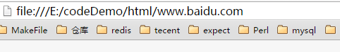

##元信息标记meta
meta元素提供的信息**不显示在页面中**，一般用来**定义页面信息的说明、关键字、刷新等**。在 HTML 中，**meta标记不需要设置结束标记，在一个尖括号内就是一个 meta 内容**。在一个HTML页面中可以有多个meta元素。 meta 元素的属性有name和http-equiv ，其中 name属性主要用于秒数网页，以便于搜索引擎的查找、分类。   

- 设置页面关键字——在搜索引擎中，检索信息都是通过输入关键字来实现的。关键字在浏览时候看不到，但是可以提供搜索引擎使用。当搜素引擎搜索网站时，如果网页中包含了关键字，就可以在搜索出来。  
语法：**< meta name="keywords" cotent="输入具体的关键字">**   
- 页面说明信息 ——也是为了便于搜索引擎的查找，用来说明网页的内容，页面说明在网页中也不显示:**< meta name="description" content="设置页面说明">**  
- 定义编辑器：**< meta name="genertator" content="编辑软件的名称">**
- 设置作者信息：**< meta name="author" content="作者姓名">**
- 设置网页文字以及语言：**< meta http-equiv="content-type" content="text/html;charset=字符集类型">**  
在该语法中，http-equiv用于传送HTTP通信协议的标头，而在content中才是具体的属性
值。charset用于设置网页的内码语系，也就是字符集的类型，国内常用的是GB码，charset往往设置为gb2312，即简体中文
- 设置网页的定时跳转——使用<meta/>标记可以使网页在经过一定时间后自动刷新，这可通过将http-equiv属性值设置为refresh来实现。content属性值可以设置为更新时间。（在浏览网页时经常会看到一些欢迎信息的页面，在经过一段时间后，这些页面会自动转
到其他页面，这就是网页的跳转。）   
语法：**< meta http-equiv="refresh" content="跳转时间；url=跳转到的地址">**  
**亲自测试了一下，他是跳转到指定的html上面去**   
  
##网页的主体标记body
所有body中的标签放置在一起，表明它对网页中所有未单独设置的元素起作用。 
 
-  网页背景颜色bgcolor——在该语法中的body就是页面的主体标记，bgcolor的值可以是一个已命名的颜色，也可以是十六进制的颜色值。  
语法：**< body bgcolor="背景颜色">**
-  设置网页背景图片background  
语法：**< body backgroud="图片地址">**  
-  文字颜色text  
语法：**< body text="文字颜色" >**
-  链接文字属性link——在默认情况下，浏览器以蓝色作为超链接文字的颜色，访问过的文字则颜色变为暗红色。可以通过link参数修改链接文字的颜色。  
语法：**< body link="颜色">——设置默认的链接颜色**  
	 **< body alink="颜色">——设置访问时的链接颜色**  
	 **< body vlink="corlor">——设置访问后的链接颜色**  
-  边距margin——单位：**像素**  包括上边距(topmargin)和左边距(leftmargin)  
语法：<body topmargin="400" leftmargin="500">   
-  页面注释标记：< ! --注释内容-->
##文字与段落标记
-  标题字：< h1> < h2> < h3> < h4> < h5> < h6>级别依次减少
-  标题字对其属性align  
语法：**<align=对齐方式> 包括：left center right**  
例如：< h2 align="left">2 级标题左对齐</h2>  
-  字体属性
-  