##元信息标记meta
meta元素提供的信息**不显示在页面中**，一般用来**定义页面信息的说明、关键字、刷新等**。在 HTML 中，**meta标记不需要设置结束标记，在一个尖括号内就是一个 meta 内容**。在一个HTML页面中可以有多个meta元素。 meta 元素的属性有name和http-equiv ，其中 name属性主要用于秒数网页，以便于搜索引擎的查找、分类。   

- 设置页面关键字——在搜索引擎中，检索信息都是通过输入关键字来实现的。关键字在浏览时候看不到，但是可以提供搜索引擎使用。当搜素引擎搜索网站时，如果网页中包含了关键字，就可以在搜索出来。  
语法：**< meta name="keywords" cotent="输入具体的关键字">**   
- 页面说明信息 ——也是为了便于搜索引擎的查找，用来说明网页的内容，页面说明在网页中也不显示:**< meta name="description" content="设置页面说明">**  
- 定义编辑器：**< meta name="genertator" content="编辑软件的名称">**
- 设置作者信息：**< meta name="author" content="作者姓名">**
- 设置网页文字以及语言：**< meta http-equiv="content-type" content="text/html;charset=字符集类型">**  
在该语法中，http-equiv用于传送HTTP通信协议的标头，而在content中才是具体的属性
值。charset用于设置网页的内码语系，也就是字符集的类型，国内常用的是GB码，charset往往设置为gb2312，即简体中文
- 设置网页的定时跳转——使用<meta/>标记可以使网页在经过一定时间后自动刷新，这可通过将http-equiv属性值设置为refresh来实现。content属性值可以设置为更新时间。（在浏览网页时经常会看到一些欢迎信息的页面，在经过一段时间后，这些页面会自动转
到其他页面，这就是网页的跳转。）   
语法：**< meta http-equiv="refresh" content="跳转时间；url=跳转到的地址">**  
**亲自测试了一下，他是跳转到指定的html上面去**   
  
##网页的主体标记body
所有body中的标签放置在一起，表明它对网页中所有未单独设置的元素起作用。 
 
-  网页背景颜色bgcolor——在该语法中的body就是页面的主体标记，bgcolor的值可以是一个已命名的颜色，也可以是十六进制的颜色值。  
语法：**< body bgcolor="背景颜色">**
-  设置网页背景图片background  
语法：**< body backgroud="图片地址">**  
-  文字颜色text  
语法：**< body text="文字颜色" >**
-  链接文字属性link——在默认情况下，浏览器以蓝色作为超链接文字的颜色，访问过的文字则颜色变为暗红色。可以通过link参数修改链接文字的颜色。  
语法：**< body link="颜色">——设置默认的链接颜色**  
	 **< body alink="颜色">——设置访问时的链接颜色**  
	 **< body vlink="corlor">——设置访问后的链接颜色**  
-  边距margin——单位：**像素**  包括上边距(topmargin)和左边距(leftmargin)  
语法：<body topmargin="400" leftmargin="500">   
-  页面注释标记：< ! --注释内容-->
##文字与段落标记
-  标题
	-  标题字：< h1> < h2> < h3> < h4> < h5> < h6>级别依次减少
	-  标题字对其属性align  
	语法：**<align=对齐方式> 包括：left center right**  
	例如：< h2 align="left">2 级标题左对齐</h2>  
-  正文内容  
	-  字体属性face——默认字体是宋体
	语法：**< font face="字体样式">...**  
	-  字号属性 size，还可以使用"+3" "-4"等语法
	-  颜色属性 color 
	-  粗体标记  
	语法：< b> < /b> or < strong> < /strong>
	- 斜体标记：< i>< /i> or < em> < /em> or < cite> < /cite>
	- 上标标记 sup——< sup>< /sup>   
	例如：a< sup>2+b< sup>2< /sup>
	- 下标标记 sub——< sub>< /sub>
	- 大号字小号字< big> < small>
	- 下划线标记——< u>< /u>
	- 段落标记< p> < p>
	- 换行标记 < br>
	-  不换行标记 < nobr>
	-  水平线 < hr>
	-  水平线宽度 < hr width="500">
	-  水平线高度 < hr size="高度">
	-  水平线去掉阴影< hr noshade>
	-  水平线颜色< hr color="#CC6600">
	-  对齐方式< hr align="left/right">
	-  插入空格 & nbsp;
	-  特殊符号:  
	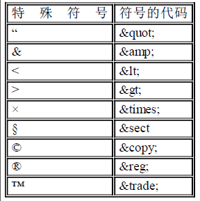   

## 图像格式  	
- img元素属性  
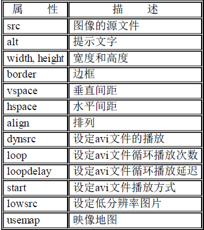  
提示：alt——当**鼠标放在图片上时给出提示**  
&nbsp;&nbsp;&nbsp;&nbsp;&nbsp;&nbsp;&nbsp;&nbsp;&nbsp;&nbsp;&nbsp;图像的宽度和高度**width、height是用来限制图像大小**  
&nbsp;&nbsp;&nbsp;&nbsp;&nbsp;&nbsp;&nbsp;&nbsp;&nbsp;&nbsp;&nbsp;**图像的边框border就是加边框咯**  
&nbsp;&nbsp;&nbsp;&nbsp;&nbsp;&nbsp;&nbsp;&nbsp;&nbsp;&nbsp;&nbsp;**垂直边距vspace——用来调整图像和文字的垂直边距**  
&nbsp;&nbsp;&nbsp;&nbsp;&nbsp;&nbsp;&nbsp;&nbsp;&nbsp;&nbsp;&nbsp;**水平边距hspace——用来调整图像和文字的水平边距**  
&nbsp;&nbsp;&nbsp;&nbsp;&nbsp;&nbsp;&nbsp;&nbsp;&nbsp;&nbsp;&nbsp;**图像的排列align——bottom、top、middle、left、center、right不懂！！！！**  
&nbsp;&nbsp;&nbsp;&nbsp;&nbsp;&nbsp;&nbsp;&nbsp;&nbsp;&nbsp;&nbsp;**图片的超链接——和文字的超链接方法类似，使用< a>标签完成,只需要将标签放在< a>< /a>之间就可以,如:< a href="链接地址">< img src="图像的地址">< /a>**  
&nbsp;&nbsp;&nbsp;&nbsp;&nbsp;&nbsp;&nbsp;&nbsp;&nbsp;&nbsp;&nbsp;**图像热区链接——多个热点区域使用usemap  不懂！！！**  
## 使用列表
- 有序列表：  
	< ol type="a" start="2">  
	< li>星期一< /li>  
	< li>星期二< /li>  
	< /ol>  
type的值：  
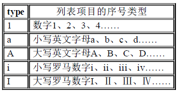  

-   无序列表类型type：  
< ul type="符号类型">  
< li>列表项< /li>  
< li>列表项< /li>  
< /ul>  
type的值：  
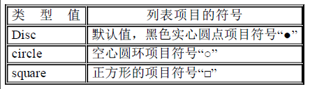  
-  定义列表标记  
< dl>  
< dt>定义条件< /dt>  
< dd>定义描述< /dd>  
< /dl>
## 表格  
< table width="表格宽度"  &nbsp;&nbsp;height="表格高度" &nbsp;&nbsp;align="left/center/right" &nbsp;&nbsp;border="" &nbsp;&nbsp;bordercolor="">  
< caption>表格标题< caption>    
< th> 表头也就是列名< /th>  
< tr>  
< td>< /td>  
< /tr>  
< tr>    
< td>  < /td>  
< td>  < /td>  
< /td>  
< /table>  

-  table——cellspacing:内框宽度（单元格之间的间距）
-  table——cellpadding:文字与边框间距
-  table——bgcolor表格背景颜色（当然是全部表格，不是单元格）
-  table——background表格背景图像（值是图像地址）
-  tr（行）属性——height bordercolor bgcolor background align(水平对齐：left center right ) valigh(垂直：top middle bottom)  
-  td(单元格)属性——width height **colspan（水平跨度） rowspan(垂直跨度)**  align valign bgcolor bordercolor bordercolorlight(亮边框)  bordercolordark（暗边框）background  
-  表格的结构(一个一个单元格去修改表的属性或者一行一行修改太麻烦了，所以需要表格的结构)：
	-  表首标记< thread bgcolor="" align="">< /thread>
	-  表格主体< tbody bgcolor="" align="">< /tbody>
	-  表尾标记< tfoot>< /tfoot>
## 超链接

-  简单的内部链接< a href="链接地址"> ...< /a>(真不知道这用来干嘛)
-  target——目标窗口的打开方式：  
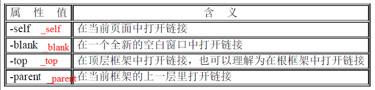  
尝试了一下，真不知道\_sef、\_top、\_parent有啥区别!!!  
-  锚点链接< a name='锚点名称'>< /a>  **< a href="#锚点名称"> < /a>** 例如:
><pre><code> < p>
    < a href="#hello">打招呼< /a>
  < /p>
  < p>
    < a name="hello">大家好，我叫luke。还请大家多多关照！< /a>
</code></pre>
链接到其他页面的锚点：   
**< a href="链接的文件地址#锚点名称">...< /a>**   

-  外部链接——**< a href="http://....">......< /a>**
-  链接到e-maill——**< a href="mailto:邮件地址">...< /a>**
-  链接到FTP(文件传输协议):大部分的FTP网站需要一个用户名和密码来进入网站。在FTP网站的链接内如果包含用户名和密码，这些信息对任何浏览源代码的人都是公开的。  
**< a href="ftp://ftp地址">...< /a>**
-  链接到telnet:telnet常常用来登录一些BBS网站，也是一种远程登录方式。  
**< a href="telnet://地址">...< /a>**  
-  下载文件——**< a href="文件路径">...< /a>**  
如果是.doc文件等，那么会产生预览功能。如果是.tar、.zip则会下载。
##多媒体
-  设置滚动效果——< marquee>....< /marquee>
	-  滚动方向——dirction:up/down/left/right
	-  滚动方式——behavior
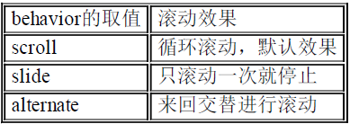  
alternate:就是那种左右左、上下上的意思。碰到边界就返回...
-  滚动的速度scrollamount(以像素为单位)
-  滚动延迟scrolldelay：时间间隔的单位是毫秒。如果时间设置过长的的话会出现走走停停的效果！
-  循环次数loop，默认是无限循环，loop可以控制次数；
-  滚动范围width和height，以像素为单位；
-  滚动的背景颜色bgcolor;
-  空白空间hspace、vspace——使用hspace和vspace可以设置它们之间的空白空间；
-  插入flash/音频/视频——**< embed src="文件地址" width="" height="">...</embed>**
-  背景音乐bgsound（文件可以是avi、mp3等格式）——**< bgsound src="文件地址">**
	-  loop——循环次数
-java Applet  
##框架结构
基本结构：  
< frameset >  
&nbsp;&nbsp;&nbsp;&nbsp;< frame>  
&nbsp;&nbsp;&nbsp;&nbsp;< frame>  
< /frameset>
  
-  frameset的性质：
	-  **rows="框架1高度,框架2高度..."**,rows的值可以是像素值也可以是百分比组成，**还可以是：20%,\***代表前面一个窗口20%，剩下的全部占用；   
	-  **cols=“框架1宽度,框架2宽度,...”**,同样cols的值也可以是像素值也可以是百分比组成.  
	-  框架的边框**frameborder="yes/no/1/0"**  
	-  框架的边框宽度**framespacing=""**(并不知道这是干嘛用的，border不就可以啦？)
	-  边框
	-  框架的边框颜色**bordercolor=""**  
	-  嵌套分割窗口：  
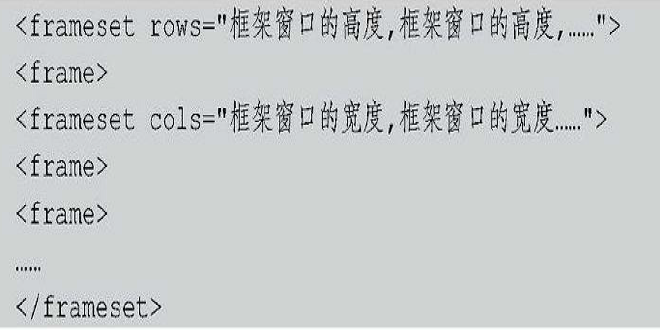  

-  frame的属性
	-  **页面源文件src=""**
	-  **页面名称name=""**(下面创建框架链接时有实例)——页面名称是为了便于页面的查找和链接所提供的一个属性。例如一个左右框架结构，左侧为链接，右侧为正文，当单击左侧链接以后要在右侧框架中打开正文，此时就需要用到< frame>的name属性（也就是上面所说的< a href="srcfile#name">的方法）。注意：**框架的页面名称中不允许包含特殊字符、连字符、空格等，必须是单个的单词或者字母组合。**
	-  **禁止调整窗口尺寸大小noresize**  
< frame src="页面源文件地址" norsize>  
	-  **边框和页面内容的水平距离marginwidth**  
	-  **边框和页面内容的垂直距离marginheight**
	-  **控制框架滚动条的显示scrolling=“yes/no/auto”**
	-  **不支持框架标记noframes**：如果遇到不支持框架结构的浏览器，或者用户关闭了浏览器的框架显示功能，此时就需要用< noframes>来设置替换的内容，告诉浏览者其浏览器无法打开框架页面。
< noframes>替换显示内容< /noframes>  
  
-  浮动框架iframe**(感觉常用在table中)**
	-  **页面源文件src=“”**
	-  宽度width=“” 高度height=""
	-  对齐方式align=“left/right/middle/bottom”
	-  滚动条scrolling=“auto/yes/no”
-  创建框架链接  
普通的框架结构之间通过target互相链接起来。一般情况下，一个页面中会有一个框架窗口作为导航页面，其中添加了对另一个框架内容的链接设置，而这些链接则是通过target来实现的。  
例如：  
common\_frame_link.html  
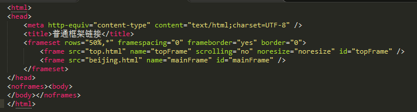  
top.html  
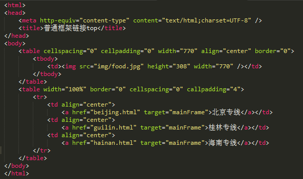  
beijing.html  
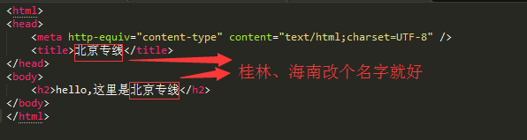
##使用表单
-  表单标记form
	-  **提交表单action=""**——action用于指定表单数据提交到那一个地址进行处理;
	-  **表单名称name=""**——name用于给表单命名，这一属性不是表单的必要属性，但是为了防止表单提交到后台处理程序时出现混乱，一般需要给表单命名;
	-  **传送方法method=""**——表单的method属性用于指定在数据提交到服务器的时候使用哪种HTTP提交方法，可取值为get或post。
		-  get：表单数据被传送到action属性指定的URL，然后这个新URL被送到处理程序上;
		-  post：表单数据被包含在表单主体中，然后被送到处理程序上;
	-  **编码方式enctype=""**	——表单中的enctype属性用于设置表单信息提交的编码方式；  
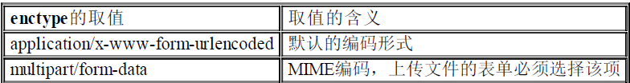  
enctype属性默认的取值是application/x-www-form-urlencoded，这是所有网页的表单所使用的可接受的类型。  
	-  target用来指定目标窗口的打开方式，表单的目标窗口往往用来显示表单的返回信息——目标窗口的打开方式有4个选项：\_blank、\_parent、\_self和\_top。其中**\_blank为将链接的文件载入一个未命名的新浏览器窗口中；\_parent为将链接的文件载入含有该链接框架的父框架集或父窗口中；\_self为将链接的文件载入该链接所在的同一框架或窗口中；_top为在整个浏览器窗口中载入所链接的文件，因而会删除所有框架**。  
	实例可以参考一下：<http://www.w3school.com.cn/tags/att_form_target.asp>
-  插入表单对象
	-  文字字段text  
		语法如下：**< input name="控件名称" type="text" value="文字字段的默认取值" size="控件的长度" maxlength="最长字符数">**
	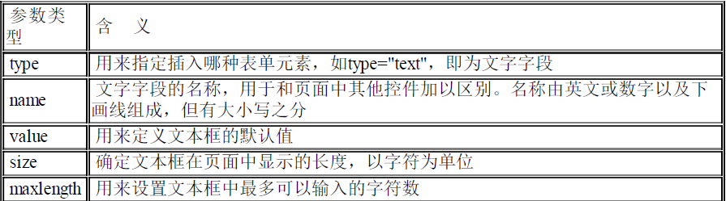
	-  **密码域password(就是把上面的type的值改为password即可)**——密码域仅仅使周围的人看不见输入的文本，它不能使数据安全。为了使数据安全，需要在浏览器和服务器之间建立一个安全链接;
	-  单选按钮radio  
	语法：< input name="单选按钮的名称" type="radio" value="单选按钮的值" checked />  
	说明：**对于一个选择列表中的所有单选按钮来说，name往往要设置为相同的名称，这样在传递时才能更好地对某一个选择内容进行判断(这句话错误)。在一个单选按钮组中只有一个单选按钮可以设置为checked。**  
	**我试了一下：确实在一个form中定义的radio只能有一个checked**  
	-  复选框  
	语法:**< input name="复选框名称" type="checkbox" value="复选框的取值" checked />**  
	事例：  
	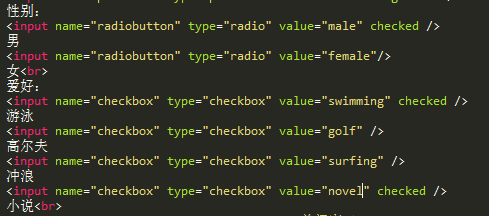  
	-  普通按钮button  
	语法:**< input type="submit" name="按钮名称" value="按钮取值" onclick="处理程序" />**  
	说明：**value的取值就是显示在按钮上的文字，在button属性中可以添加onclick来实现一些特殊的功能.**   
	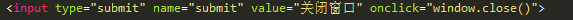
	-  提交按钮submit  
	语法：**< input type="submit" name="按钮名称" value="按钮的取值" />**
	-  重置按钮reset  
	语法：**< input type="reset" name="按钮名称" value="按钮的取值" />**
	-  图像域(**使用一幅画作为按钮**)  
	语法：**< input name="图像的名称" type="image" src="图像路径" />**
	-  隐藏域hidden(用来传送那些不需要对用户可见的数据)  
	语法：**< input name="隐藏域" type="hidden" value="隐藏域的取值" />**
	-  文件域(**文件域在上传文件时常常用到，它用于查找硬盘中的文件路径，然后通过表单将选中的文件上传，在上传图像时也常常用到**)   
	语法：**< input name="文件域名" type="file" size="控件的长度" maxlength="最长字符数" />**  
	事例:  
	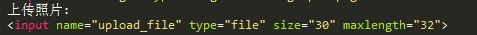  
-  菜单和列表  
	-  下拉菜单  
	语法:**< select name="下拉菜单名称">  
		 < option value="选项值" selected>选项显示内容  
		 ....  
		< /select>**
	- 列表项  
	语法：**< select name=“列表项名称” size="显示的列表项数" mutiple>   
	< option value="选项值" selected>选项显示内容  
	...
	< /select>**  
	说明：size用于设置在页面中显示的最多列表项数，当超过这个值时会出现滚动条。  
-  文本域标记textarea  
	语法：**< textarea name="文本域名称" cols="列数" rows="行数">< /testarea>**  
	说明：**在语法中，不能使用value属性来建立一个在文本域中显示的初始值。cols和rows是用来控制testarea显示的窗口的大小，并不是用来控制职能输入多少文字**
-  id标记(**主要用于标示一个惟一的元素**)  
	语法：< id=元素的标识名>   
	事例：  
	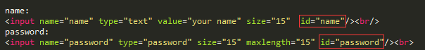
	

	